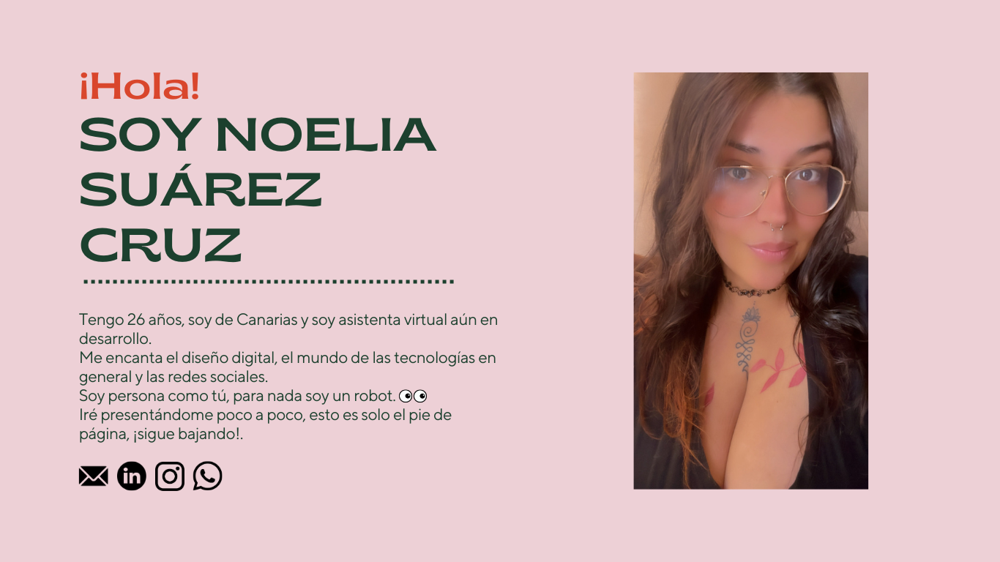
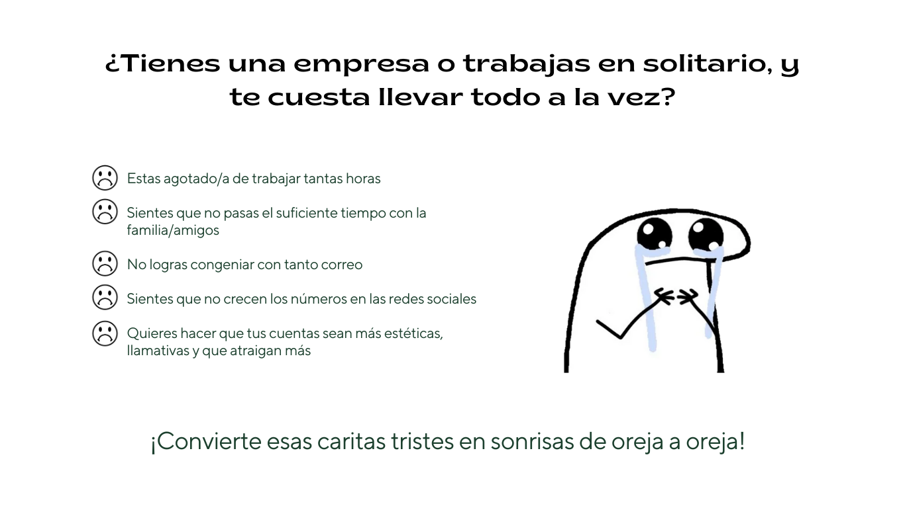
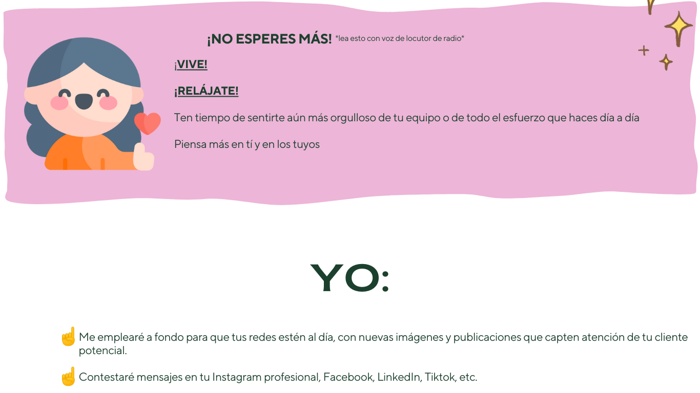
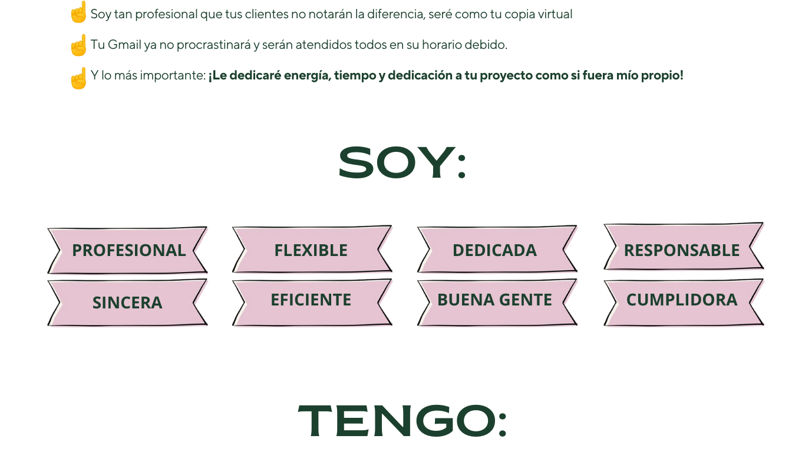
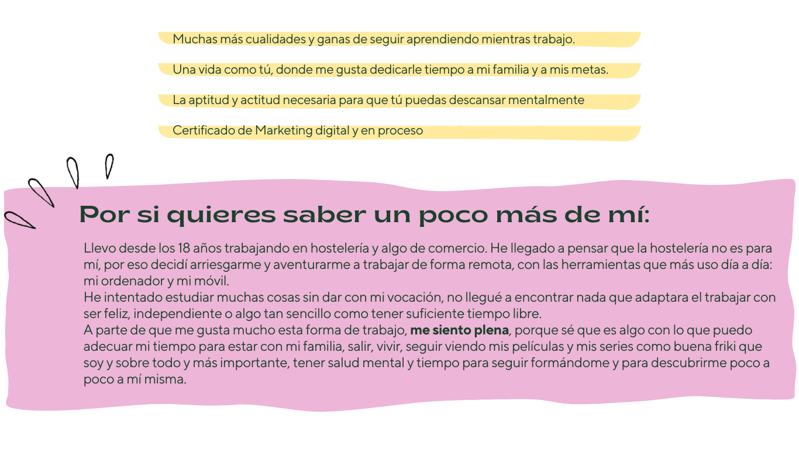
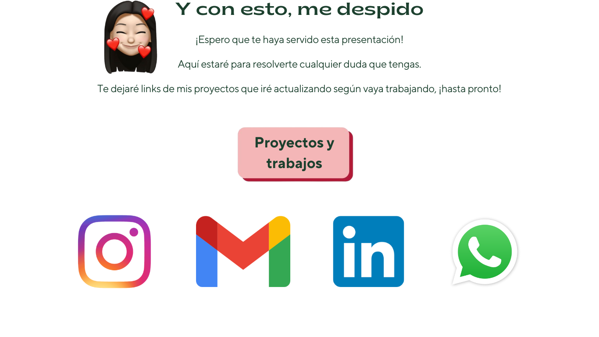

# Noelia Suárez Cruz - Asistencia virtual

Este pequeño proyecto trata de presentar a una magnífica asistenta virtual.

## Table of contents

- [Overview](#overview)
  - [The challenge](#the-challenge)
  - [Links](#links)
- [My process](#my-process)
  - [Built with](#built-with)
  - [What I learned](#what-i-learned)
  - [Continued development](#continued-development)
- [Author](#author)
- [Acknowledgments](#acknowledgments)

## Overview

### The challenge

La clienta nos solicitó un proyecto web básico, a raíz de algo que ella mismo planificó desde Canvas.
El reto consistía en dejarlo lo más parecido posible a lo siguiente:

### Links

- Live Site URL: [Aquí puedes ver el sitio web](https://jmp89.github.io/meromero/)

## My process

### Built with

- Semantic HTML5 markup
- CSS custom properties
- Flexbox
- CSS Animations
- Mobile-first workflow
- JavaScript

### What I learned

En este proyecto he aprendido bastantes detalles de CSS, como por ejemplo crear botones en base a imágenes.
Además de hacer un tipo de "inifinite scroll" (aunque en este caso, solo cambia entre clases que determinan la opacidad de las secciones)

### Continued development

I'm practicing every day to improve my skills as developer, and the next step in the academy's bootcamp is about backend, so i hope that makes me grow nicely.

I worked in a little project for our academy, practicing everything we already learned.

- Hack a Boss Quiz Project - [Check it out](https://github.com/3dmnt/HAB-36-GrupoE)

After that, i started the FrontMentor's challenges, doing this as my first challenge:

- Recipe challenge: [Live Site](https://jmp89.github.io/FM-Recipe/)

And then i continued making challenges in FrontMentor:

- Newsletter sign-up form with success message challenge: [Live Site](https://jmp89.github.io/FM-NewsletterSignUpFWSMH/)
- FAQ accordion solution challenge: [Live Site](https://jmp89.github.io/FM-faq-accordion/)

## Author

- Website - [jmp89](https://github.com/jmp89)
- Frontend Mentor - [@jmp89](https://www.frontendmentor.io/profile/jmp89)
- Linkedin - [Juan Macias](https://www.linkedin.com/in/juan-maciasp/)

## Acknowledgments

Para este proyecto, la clienta tenía una idea clara de como quería cada cosa, en comunicación con ella, me facilitó las imágenes de su idea, los códigos de colores y las fuentes que quería usar.
